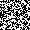
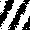
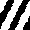

# Activator / Inhibitor Cellular Automaton
The purpose here is to investigate the creation of spatial structure by activator and inhibitor cellular automaton. To do this, I wrote a simulator to see how different parameters affected correlation and mutual information between cells in a 30 x 30 cellular automaton. Below is an example of a simulation.

	
	
	
	
	

