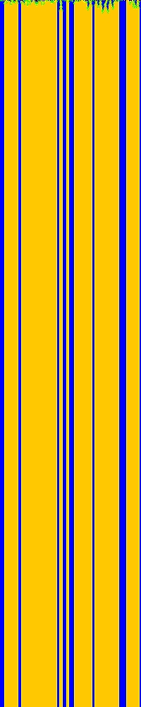
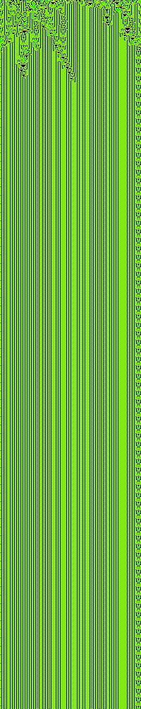
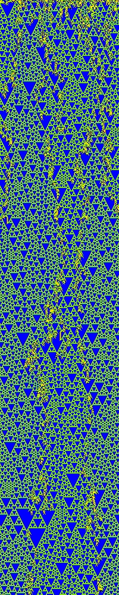
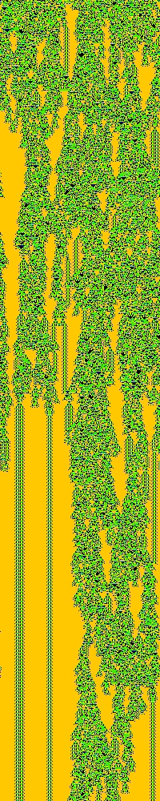

# The Edge of Chaos Phenomena
The purpose here is to investigate one-dimensional cellular automata and how we can more reliably achieve complex "Edge of Chaos" behavior, which is more commonly known as Wolfram class IV behavior. This behavior has valuable properties that could be used in future areas of computing, so it is useful for us to know how to replicate it. Below is an example of the different classes of 1D CA (class I through IV from left to right).

	
	
	
	

